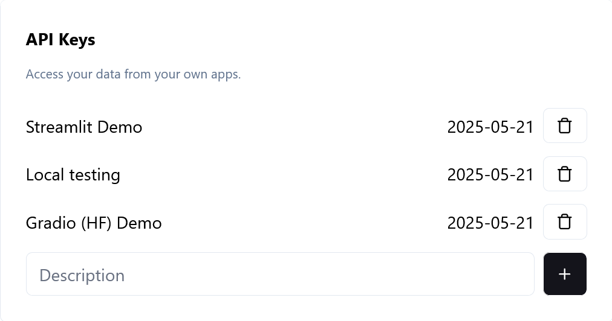

.. _accounts:

Accounts & Access
#################

To get an account, someone with access must add your email to the ``authorizedusers`` table in the ``app`` database. Accounts with restricted access (``fullAccess = false``) will get their own copy of the database, which can be updated from the main database, but cannot write to the main database.

.. warning::
   Accounts with full access (and applications using their API keys) will work directly (including write access) with the main copy. **Be careful!**

.. _api-keys:

API Keys
********

To create an API key, open your account settings to the 'API Keys' section, enter an optional (but recommended) description, and click the plus button.

This key can then be used with the :doc:`api` or :doc:`sdk`.