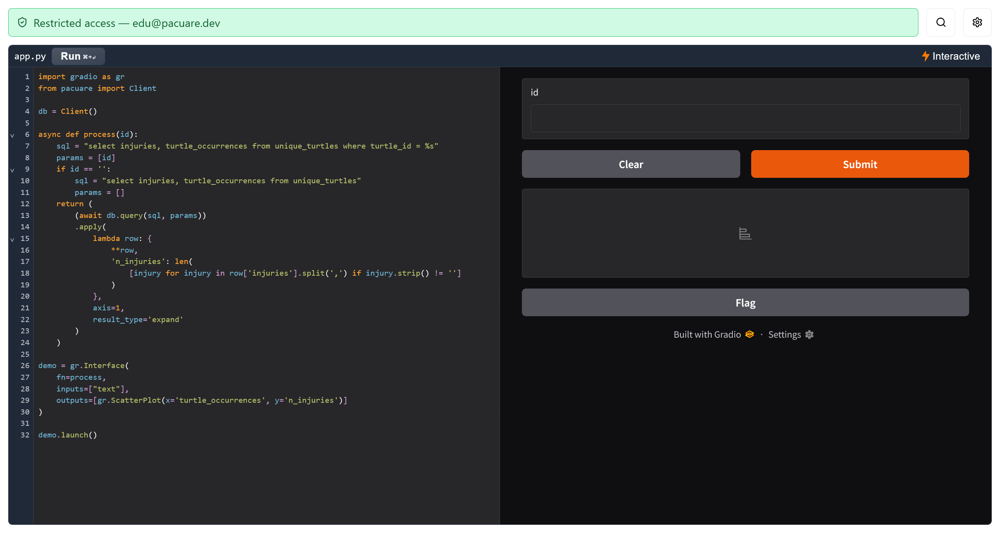

.. _python:

Python Quickstart
=================

.. note::
   This section describes the Python Playground, not the Python SDK. The documentation on that is :ref:`here <sdk>`.

The **Python** tab on the dashboard provides a [Gradio Lite]() development environment with access to your database, preloaded with an example.

.. caution::
   Your modifications are not saved between reloads! This playground is meant for prototyping -- consider using the :ref:`sdk` for larger projects.