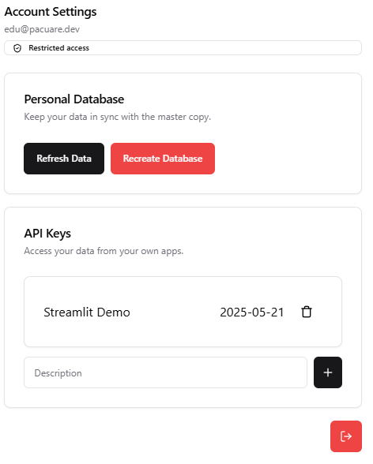

.. _sql:

SQL Quickstart
##############

When you first open the dashboard, you'll be greeted by a "Welcome to Pacuare Reserve!" screen (if you have full access, this screen will be skipped; this screen shows while restricted accounts' personal databases are being created), followed by the main screen.
In the upper right corner of your screen will be a magnifying glass icon; click this to open the SQL query tool. This window can be moved around your screen via the handle at the top, and can be closed by clicking on the magnifying glass again.

This is the simplest way to query the database, and queries you enter here will be run directly on your copy of the database (if your access is restricted) or the database itself (if you have full access).

.. note::
   See :doc:`accounts` for more information on access levels.

If you're `signed in <https://app.pacuare.dev/login>`_, you can also run queries in the standalone query editor, embedded right here:

.. raw:: html

   <iframe src="https://app.pacuare.dev/query" style="border: none; width: 100%; min-height: 300px; resize: vertical"></iframe>

Take a look at some :doc:`useful-queries` for inspiration. Try copying and running the statement under ``unique_turtles`` to show a list of unique turtles. The ``unique_turtles`` view is now stored in your personal database, and can be queried with ``select * from unique_turtles`` at any time.

Once you run a query, you can download the results as a CSV via the button in the lower-right corner of the window.

.. note::
   The `Neon PostgreSQL tutorial <https://neon.tech/postgresql/tutorial>`_ is an easy way to get started with PostgreSQL, the database used by the Pacuare system.

.. note::
   ``spanish_bool`` (also provided in that page) is also a very useful function to have around.

.. warning::
   If you try to run multiple statements at once, you'll get an error! This is because the app runs your query as one single prepared statement, which can (as the name suggests) only contain one statement. For more complicated queries, consider making a stored function or using :doc:`Python <python>`.

Augh! My database is broken!
****************************

If you have a full-access account, this is a problem. Please contact an administrator.

If you have a limited-access account, though, putting your data back in order is easy. Open your account settings with the gear icon in the upper-right corner.

.. note::
   This window, like the query tool, can also be moved and resized on yur screen.

If the data in your ``pacuare_raw`` table is corrupted, and you'd like to keep everything else, click **Refresh Data**. This will delete all of the rows in the table and re-import from the master database. If the *structure* is corrupted, or if something else in the database is broken, click **Recreate Database**. This will effectively delete and recreate your account and all of your data, so use it judiciously.
