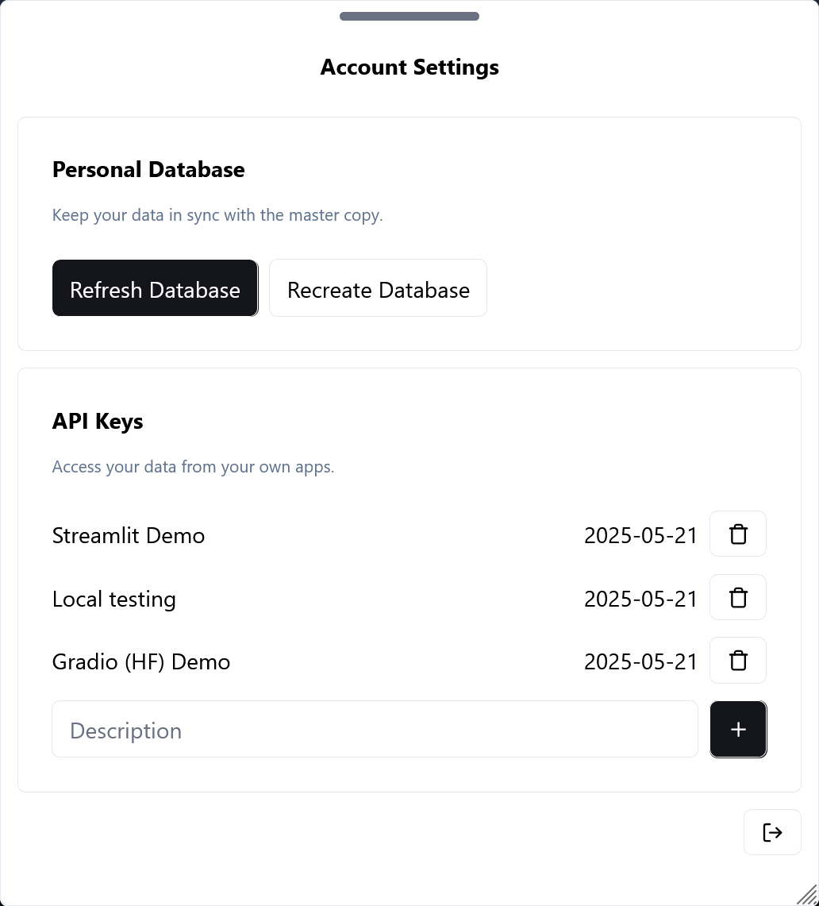

.. _sql:

SQL Quickstart
##############

When you first open the dashboard, you'll be greeted by a "Welcome to Pacuare Reserve!" screen (if you have full access, this screen will be skipped; this screen shows while restricted accounts' personal databases are being created), followed by the main screen.
In the upper right corner of your screen will be a magnifying glass icon; click this to open the SQL query tool.

This is the simplest way to query the database, and queries you enter here will be run directly on your copy of the database (if your access is restricted) or the database itself (if you have full access).

.. note::
   See :doc:`accounts` for more information on access levels.

Take a look at some :doc:`useful-queries` for inspiration. Try copying and running (one at a time) the statements under ``turtle_occurrences`` and **Unique Turtles** to show a list of unique turtles. The ``turtle_occurrences`` function is now stored in your personal database, and can be called again at any time.

.. note::
   ``spanish_bool`` (also provided in that page) is also a very useful function to have around.

.. warning::
   If you try to run multiple statements at once, you'll get an error! This is because the app runs your query as one single prepared statement, which can (as the name suggests) only contain one statement. For more complicated queries, consider making a stored function or using :doc:`Python <python>`.

Augh! My database is broken!
****************************

If you have a full-access account, this is a problem. Please contact an administrator.

If you have a limited-access account, though, putting your data back in order is easy. Open your account settings with the gear icon in the upper-right corner.

If the data in your ``pacuare_raw`` table is corrupted, and you'd like to keep everything else, click **Refresh Data**. This will delete all of the rows in the table and re-import from the master database. If the *structure* is corrupted, or if something else in the database is broken, click **Recreate Database**. This will effectively delete and recreate your account and all of your data, so use it judiciously.
